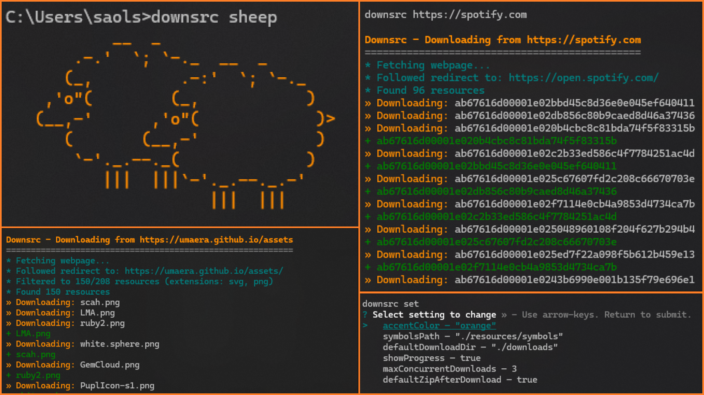

<h2>
<p align="center">☆ DownSrc ☆</p>

<p align="center">"I just want to download my stuff ugh.." </p>
</h2>

<div align="center">

[Start Using](#-installation) •
[Documentation](#-documentation) •
[Versions](https://github.com/everm4iva/downsrc/tags) •
[Credits](#-dependencies)

</div>

<p align="center">

A simple, cute command-line tool for downloading files and websites.
</p>

## ☆-Features

- Download single files or entire webpages with the resources intact!
- **Deep scraping** - Follow same-domain links recursively
- **File extension filtering** - Download only specific file types
- Colorful terminal interface with progress bars
- Multiple download flags and options
- Zip downloaded files automatically
- Generate HTML reports
- Custom actions for automation
- Configurable settings
- Funny commands `cat`, `sheep`, `bee`

## ☆-Installation

```bash
npm install -g @everm4iva/downsrc
```

### ☆-Start using it!

```bash
# Download a file
downsrc https://example.com/file.zip

# Download a webpage with all resources (just that page)
downsrc https://example.com/page.html

# Download and zip
downsrc -z https://example.com/website

# Download with quality report
downsrc --dr https://example.com/files

# Download only specific file types
downsrc --fe "png & jpg" https://example.com/gallery

# Advanced scraping - follow 5 links on same domain
downsrc --as 5 https://example.com/website

# Combine filters: scrape 3 links, only download PDFs
downsrc --as 3 --fe pdf https://example.com/docs

# Check if link is accessible
downsrc -c https://example.com/file.zip

# Check security/certificates
downsrc -v https://example.com
```

## ☆-Available Commands

### Basic Usage

- `downsrc <url>` - Download from URL
- `downsrc help` - Show help with examples
- `downsrc details` - Show package information
- `downsrc cat` - Display cat symbol

### Settings

- `downsrc set <var> <value>` - Change configuration
- `downsrc action add <name> <command>` - Add custom action
- `downsrc action remove <name>` - Remove action
- `downsrc action list` - List all actions
- `downsrc run <action>` - Run custom action

## Flags

### Download Options

- `-o` - Open file after download
- `-z` - Zip files after download
- `-p <path>` - Specify download path
- `--tl <seconds>` - Set time limit
- `--ms <mb>` - Maximum file size (skip)
- `--mss <mb>` - Maximum file size (pause and ask)
- `--fe <extensions>` - Filter by file extension (e.g., `png & jpg & webp`)
- `--as <number>` - Advanced scraping - follow N links from the page (same-domain links)

### Reports and UI

- `--hr` - Generate HTML report
- `--hh` - Host interactive HTML UI in browser
- `--dr` - Show download quality report
- `-d` - Include debug.txt in zip

### Checking

- `-c` - Check link accessibility
- `-v` - Check vulnerabilities/security

### Automation

- `-y` - Yes to all prompts
- `-n` - No to all prompts
- `--debug-on` - Enable debug mode
- `--debug-off` - Disable debug mode

## ☆-Documentation
For now.. none, keep exploring on ur own

<!-- Documentation is available in the [docs](docs/) folder:

- [Getting Started](docs/getting-started.md)
- [Flags Reference](docs/flags.md)
- [Configuration](docs/configuration.md)
- [Actions](docs/actions.md)
- [Examples](docs/examples.md) -->

## ☆-Examples

<details>
<summary>Download and open a file</summary>

```bash
downsrc -o https://example.com/document.pdf
```
</details>

<details>
<summary>Download website with time limit</summary>

```bash
downsrc --tl 60 https://example.com/website
```

</details>

<details>
<summary>Download only specific file types</summary>

```bash
# Download only PNG images
downsrc --fe png https://example.com/gallery
# Download multiple image formats
downsrc --fe "png & jpg & webp" https://example.com/gallery
```
</details>

<details>
<summary>Advanced scraping - follow links</summary>

```bash
# Follow and download up to 5 links from the page
downsrc --as 5 https://example.com
# Follow all links (prompts if more than 10)
downsrc --as https://example.com
# Download page and follow up to 3 same-domain links
downsrc -as 3 https://example.com/website
# Download page and follow all same-domain links (will prompt if >10)
downsrc -as https://example.com/website
# Download only the page and resources (root-num = 0)
downsrc -as 0 https://example.com/page
```
</details>

<details>
<summary>File extension filtering</summary>

```bash
# Download only PNG images
downsrc -fe png https://example.com/gallery
# Download multiple file types
downsrc -fe "png & jpg & webp & svg" https://example.com/images
# Combine with advanced scraping
downsrc -as 5 -fe "pdf & docx" https://example.com/documents
```
</details>

<details>
<summary>Complete workflow</summary>

```bash
downsrc -z --hr --dr -p ./downloads https://example.com/project
```
</details>

<details>
<summary>Create and run custom action</summary>

```bash
downsrc action add backup "tar -czf backup.tar.gz ./downloads"
downsrc run backup
```
</details>

## ☆-Configuration

<details>
<summary>Settings configuration</summary>

Settings are stored in `resources/coolshits.json`:
```json
{
    "accentColor": "orange",
    "defaultDownloadDir": "./downloads",
    "maxConcurrentDownloads": 3,
    "defaultZipAfterDownload": false
}
```

Change settings via command line:

```bash
downsrc set maxConcurrentDownloads 5
downsrc set defaultZipAfterDownload true
```
</details>

## ☆-Architecture

- Pure JavaScript (no TypeScript or frameworks)
- Modular and configurable design
- All variables in `coolshits.json`
- Custom actions in `actions.json`
- Simple symbols instead of emoji (»\*+-#$!)
- Orange accent color theme

## ☆-Project Structure

```
downsrc/
├── bin/
│   └── downsrc.js          # CLI entry point
├── resources/
│   ├── index.js            # Main module
│   ├── logic.js            # Download logic
│   ├── terminal-wowies.js  # Terminal UI
│   ├── fs.js               # File operations
│   ├── settings.js         # Configuration
│   ├── debugger.js         # Logging system
│   ├── server.js           # Web UI server
│   ├── coolshits.json      # Settings file
│   ├── actions.json        # Custom actions
│   ├── commands/           # Command handlers
│   │   ├── zipper.js
│   │   ├── htmlgen.js
│   │   ├── report.js
│   │   ├── check-vul.js
│   │   ├── timelimit.js
│   │   └── actions.js
│   └── symbols/
│       └── cat.txt
├── docs/                   # Documentation
└── package.json
```

## ☆-Dependencies
Big help! thank u so much

- `minimist` - Argument parsing
- `chalk` - Terminal colors
- `cli-progress` - Progress bars
- `archiver` - Zip creation
- `cheerio` - HTML parsing
- `p-limit` - Concurrency control
- `prompts` - User input
- `open` - Open files

## ☆-Contributing

Free to do something. in fact.. free to do anything, did u read the [LICENSE](LICENSE)  file??


## ☆-Author - [**everm4iva** (m4iva)](https://everm4iva.github.io)